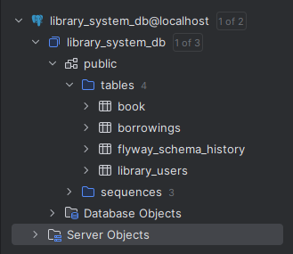

# System Zarządzania Biblioteką (Library System)

Nowoczesny system do zarządzania zasobami bibliotecznymi i wypożyczeniami, zbudowany z wykorzystaniem Spring Boot, Spring Security, JPA/Hibernate oraz PostgreSQL, konteneryzowany przy użyciu Docker.

---

## 📋 Spis treści

1.  [🎯 Opis projektu](#opis-projektu)
2.  [✨ Kluczowe funkcjonalności](#kluczowe-funkcjonalnosci)
3.  [🏗️ Architektura i wzorce projektowe](#architektura-i-wzorce-projektowe)
    * [Wzorce projektowe](#wzorce-projektowe)
    * [Polimorfizm](#polimorfizm)
4.  [🔐 System autoryzacji (RBAC)](#system-autoryzacji-rbac)
    * [Role użytkowników](#role-uzytkownikow)
    * [Implementacja bezpieczeństwa](#implementacja-bezpieczenstwa)
5.  [🚀 Technologie](#technologie)
6.  [🐳 Szybki start z Docker](#szybki-start-z-docker)
7.  [📚 Dokumentacja API (Swagger)](#dokumentacja-api-swagger)
8.  [🗄️ Model bazy danych (ERD)](#model-bazy-danych-erd)
9.  [🔧 Konfiguracja](#konfiguracja)
10. [🧪 Testowanie](#testowanie)
11. [📸 Zrzuty ekranu](#zrzuty-ekranu) 

---

## 🎯 Opis projektu

**System Zarządzania Biblioteką** to aplikacja webowa umożliwiająca efektywne zarządzanie zbiorami książek, procesem ich wypożyczania oraz użytkownikami systemu. Aplikacja została zaprojektowana z myślą o modularności, bezpieczeństwie i łatwości obsługi, zgodnie z zasadami programowania obiektowego i SOLID.

---

## ✨ Kluczowe funkcjonalności

* **👤 Zarządzanie użytkownikami:**
    * Rejestracja nowych użytkowników.
    * Logowanie użytkowników.
    * System ról (Użytkownik, Administrator).
* **📚 Katalog książek:**
    * Dodawanie, edycja, usuwanie książek (Admin).
    * Przeglądanie i wyszukiwanie książek (Wszyscy zalogowani).
* **🎫 Zarządzanie wypożyczeniami:**
    * Wypożyczanie książek przez użytkowników.
    * Zwracanie książek.
    * Przeglądanie historii wypożyczeń (własnych dla User, wszystkich dla Admin).

---

## 🏗️ Architektura i wzorce projektowe

Projekt został zbudowany zgodnie z **filarami obiektowości** i **zasadami SOLID**. Zastosowano standardową architekturę warstwową typową dla aplikacji Spring Boot (Kontrolery, Serwisy, Repozytoria).

### Wzorce projektowe

1.  **Wzorzec Strategia (Strategy Pattern)** 🎯
    * **Lokalizacja:** `com.example.librarysystem.service.policy.LoanPolicy` (interfejs) oraz jego implementacje `StandardLoanPolicy` i `AcademicLoanPolicy`.
    * **Opis:** Wzorzec Strategia został użyty do zdefiniowania różnych polityk obliczania terminu zwrotu książki. `BorrowingService` korzysta z wstrzykniętej implementacji `LoanPolicy` do elastycznego określania daty zwrotu, co pozwala na łatwe dodawanie nowych polityk wypożyczeń bez modyfikacji samego serwisu. Wymóg użycia wzorca projektowego jest spełniony.

    ```java
    // Interfejs LoanPolicy
    public interface LoanPolicy {
        LocalDate calculateDueDate(LocalDate borrowDate, Book book, User user);
    }

    // Implementacja StandardLoanPolicy
    @Component("standardLoanPolicy")
    public class StandardLoanPolicy implements LoanPolicy {
        private static final int STANDARD_LOAN_DURATION_DAYS = 14;
        @Override
        public LocalDate calculateDueDate(LocalDate borrowDate, Book book, User user) {
            return borrowDate.plusDays(STANDARD_LOAN_DURATION_DAYS);
        }
    }
    ```

2.  **Wzorzec Budowniczy (Builder Pattern) w Spring Security** 🛠️
    * **Opis:** Konfiguracja obiektu `HttpSecurity` w klasie `SecurityConfig` odbywa się poprzez łańcuch wywołań metod (tzw. fluent API), co jest charakterystyczne dla wzorca Budowniczego. Jest to mechanizm dostarczany przez sam framework Spring Security, umożliwiający czytelne i krokowe definiowanie reguł bezpieczeństwa.
        ```java
        // Fragment SecurityConfig.java demonstrujący wzorzec Budowniczy
        http
            .csrf(csrf -> csrf.disable())
            .authorizeHttpRequests(authz -> authz
                .requestMatchers("/api/users/register").permitAll()
                // ... dalsze konfiguracje ...
            )
            .formLogin(formLogin -> formLogin /* ... */);
        ```
    * Dodatkowo, sam framework Spring Security wewnętrznie wykorzystuje inne wzorce, takie jak Łańcuch Odpowiedzialności (dla filtrów) czy Strategia (dla mechanizmów uwierzytelniania), co przyczynia się do jego elastyczności.

### Polimorfizm

System wykorzystuje **polimorfizm** poprzez interfejs `LoanPolicy`. Serwis `BorrowingService` operuje na abstrakcji `LoanPolicy`, a konkretne zachowanie (sposób obliczania daty zwrotu) jest determinowane przez rzeczywisty typ obiektu (np. `StandardLoanPolicy`, `AcademicLoanPolicy`) wstrzyknięty w czasie działania aplikacji. To również spełnia wymóg implementacji polimorfizmu w projekcie.

```java
// W BorrowingService
private final LoanPolicy loanPolicy;

public BorrowingService(/*...*/, @Qualifier("standardLoanPolicy") LoanPolicy loanPolicy) {
    this.loanPolicy = loanPolicy;
}

public Borrowing borrowBook(Long userId, Long bookId) {
    // ...
    LocalDate dueDate = this.loanPolicy.calculateDueDate(borrowDate, book, user); // Wykorzystanie polimorfizmu
    // ...
}
```

## 🔐 System autoryzacji (RBAC)

System implementuje **Role-Based Access Control** z dwoma głównymi rolami użytkowników.

### Role użytkowników

| Rola         | Opis                | Główne Uprawnienia                                                                                                                                  |
| :----------- | :------------------ | :-------------------------------------------------------------------------------------------------------------------------------------------------- |
| `ROLE_USER`  | Zwykły użytkownik   | • Przeglądanie książek <br>• Wypożyczanie i zwracanie książek <br>• Przeglądanie własnej historii wypożyczeń                                              |
| `ROLE_ADMIN` | Administrator systemu | • Wszystkie uprawnienia `ROLE_USER` <br>• Zarządzanie katalogiem książek (dodawanie, edycja, usuwanie) <br>• Zarządzanie użytkownikami <br>• Przeglądanie wszystkich wypożyczeń  |

### Implementacja bezpieczeństwa

Bezpieczeństwo aplikacji oparte jest na Spring Security. Konfiguracja znajduje się w klasie `com.example.librarysystem.config.SecurityConfig`.
Logowanie odbywa się poprzez standardowy formularz Spring Security.

```java
// Fragment SecurityConfig.java
@Configuration
@EnableWebSecurity
public class SecurityConfig {

    @Bean
    public PasswordEncoder passwordEncoder() {
        return new BCryptPasswordEncoder();
    }

    @Bean
    public SecurityFilterChain filterChain(HttpSecurity http) throws Exception {
        http
                .csrf(csrf -> csrf.disable())
                .authorizeHttpRequests(authz -> authz
                        .requestMatchers("/api/users/register").permitAll() // Pozwala na dostęp do rejestracji dla wszystkich
                        .requestMatchers("/swagger-ui/**", "/v3/api-docs/**", "/swagger-ui.html").permitAll() // Pozwala na dostęp do Swagger UI dla wszystkich
                        .requestMatchers(HttpMethod.GET, "/api/books", "/api/books/**").hasAnyRole("USER", "ADMIN") // Dostęp do książek dla USER i ADMIN
                        .requestMatchers("/api/borrowings/borrow", "/api/borrowings/**/return").hasAnyRole("USER", "ADMIN") // Wypożyczanie i zwrot dla USER i ADMIN
                        .requestMatchers("/api/borrowings/user/**").hasAnyRole("USER", "ADMIN") // Historia wypożyczeń użytkownika dla USER i ADMIN
                        .requestMatchers(HttpMethod.POST, "/api/books").hasRole("ADMIN") // Dodawanie książek tylko dla ADMIN
                        .requestMatchers(HttpMethod.PUT, "/api/books/**").hasRole("ADMIN") // Aktualizacja książek tylko dla ADMIN
                        .requestMatchers(HttpMethod.DELETE, "/api/books/**").hasRole("ADMIN") // Usuwanie książek tylko dla ADMIN
                        .requestMatchers("/api/users/**").hasRole("ADMIN") // Zarządzanie użytkownikami (oprócz /register) tylko dla ADMIN
                        .requestMatchers("/api/borrowings").hasRole("ADMIN") // Wszystkie wypożyczenia tylko dla ADMIN
                        .anyRequest().authenticated() // Wszystkie inne żądania wymagają uwierzytelnienia
                )
                .formLogin(formLogin -> formLogin
                        .defaultSuccessUrl("/swagger-ui.html", true) // Przekierowanie po udanym logowaniu
                        .permitAll() // Strona logowania dostępna dla wszystkich
                )
                .logout(logout -> logout
                        .logoutSuccessUrl("/?logout=true") // Przekierowanie po wylogowaniu
                        .permitAll() // Strona wylogowania dostępna dla wszystkich
                );
        return http.build();
    }
}
```
---

## 🚀 Technologie

**Backend Stack:**
* Java 21
* Spring Boot 3.3.0
* Spring Security 6
* Spring Data JPA
* Hibernate
* Lombok

**Baza danych:**
* PostgreSQL 15
* Flyway (do zarządzania migracjami schematu bazy danych)
* HikariCP (pula połączeń)

**Narzędzia DevOps & Budowanie:**
* Docker & Docker Compose (konteneryzacja aplikacji i bazy danych)
* Maven (zarządzanie zależnościami i procesem budowania)

**Dokumentacja & Testowanie:**
* SpringDoc OpenAPI (Swagger UI) (interaktywna dokumentacja API)
* JUnit 5 (testy jednostkowe i integracyjne)
* Mockito (mockowanie w testach jednostkowych)
* Testcontainers (testy integracyjne z prawdziwą bazą PostgreSQL w kontenerze)
* JaCoCo (analiza pokrycia kodu testami)

---

## 🐳 Szybki start z Docker

**Wymagania:**
* JDK 21 lub nowsze (do budowania projektu Mavenem)
* Maven 3.6+ (do budowania projektu)
* Docker Desktop (do uruchamiania kontenerów)
* Docker Compose

**Uruchomienie:**

1.  Zbuduj projekt za pomocą Mavena (tworzy plik JAR):
    ```bash
    mvn clean install
    ```
2.  Uruchom cały stos aplikacji (aplikacja + baza danych) za pomocą Docker Compose:
    ```bash
    docker-compose up --build
    ```
    Flaga `--build` wymusza przebudowanie obrazu aplikacji, jeśli zaszły zmiany.

**Dostęp do aplikacji:**
* API będzie dostępne pod adresem: `http://localhost:8080`
* Dokumentacja Swagger UI: `http://localhost:8080/swagger-ui.html`
* Baza danych PostgreSQL (jeśli potrzebujesz się połączyć z zewnątrz): `localhost:5432` (użytkownik: `postgres`, hasło: `admin` - zgodnie z `docker-compose.yml`)

**Pierwsze kroki:**
1.  Otwórz Swagger UI: `http://localhost:8080/swagger-ui.html`
2.  Zarejestruj nowego użytkownika używając endpointu `POST /api/users/register`.
    Przykładowe ciało żądania:
    ```json
    {
      "username": "user",
      "password": "user",
      "role": "ROLE_USER"
    }
    ```
    Lub dla admina:
    ```json
    {
      "username": "admin",
      "password": "admin",
      "role": "ROLE_ADMIN"
    }
    ```
3.  Użyj danych nowo utworzonego użytkownika, aby zalogować się przez formularz Spring Security (domyślnie `http://localhost:8080/login`, na który zostaniesz przekierowany próbując uzyskać dostęp do zabezpieczonego zasobu). Po zalogowaniu zostaniesz przekierowany na `/swagger-ui.html`.
4.  Możesz teraz testować inne endpointy API wymagające autoryzacji.

---

## 📚 Dokumentacja API (Swagger)

Interaktywna dokumentacja API jest dostępna pod adresem `http://localhost:8080/swagger-ui.html` po uruchomieniu aplikacji. Opisuje ona wszystkie dostępne endpointy, ich parametry, oczekiwane ciała żądań oraz możliwe odpowiedzi. Została zaimplementowana przy użyciu SpringDoc OpenAPI.

**Główne moduły API:**
* `/api/users`: Zarządzanie użytkownikami (rejestracja, pobieranie danych).
* `/api/books`: Zarządzanie książkami (CRUD, przeglądanie).
* `/api/borrowings`: Zarządzanie wypożyczeniami (tworzenie wypożyczenia, zwrot, historia).

---

## 🗄️ Model bazy danych (ERD)

Schemat bazy danych jest zarządzany przez Flyway. Pierwsza migracja (`V1__Create_base_tables.sql`) tworzy następujące tabele: `library_users`, `book`, `borrowings` wraz z ich relacjami.

*(Tutaj wstaw swój wygenerowany diagram ERD jako obrazek. Możesz go umieścić w repozytorium np. w folderze `docs/images/` i podlinkować. Upewnij się, że ścieżka jest poprawna, np.:)*

---

## 🔧 Konfiguracja

Główne pliki konfiguracyjne projektu:

* **`application.properties`**:
    * Zawiera podstawową konfigurację aplikacji Spring Boot.
    * Definiuje placeholdery dla danych dostępowych do bazy danych (np. `${SPRING_DATASOURCE_URL}`), które są dostarczane przez zmienne środowiskowe podczas uruchamiania z Docker Compose.
    * Ustawia `spring.jpa.hibernate.ddl-auto` na `validate` (lub wartość domyślną przekazaną przez zmienną środowiskową), co oznacza, że Hibernate weryfikuje zgodność schematu bazy danych (stworzonego przez Flyway) z encjami JPA.
    * Konfiguruje `spring.flyway.enabled=true`, aby aktywować zarządzanie migracjami bazy danych przez Flyway.

* **`docker-compose.yml`**:
    * Definiuje serwisy Dockerowe dla aplikacji (`app`) oraz bazy danych PostgreSQL (`db`).
    * Określa obrazy Dockerowe, mapowania portów (np. `8080:8080` dla aplikacji, `5432:5432` dla bazy danych).
    * Ustawia zmienne środowiskowe dla kontenera aplikacji, w tym dane dostępowe do bazy danych (`SPRING_DATASOURCE_URL=jdbc:postgresql://db:5432/library_system_db`, `SPRING_DATASOURCE_USERNAME`, `SPRING_DATASOURCE_PASSWORD`) oraz `SPRING_JPA_HIBERNATE_DDL_AUTO=validate`.
    * Definiuje wolumen (`postgres_data`) dla persystencji danych bazy PostgreSQL.
    * Zawiera konfigurację `healthcheck` dla serwisu bazy danych.

* **`src/main/resources/db/migration/`**:
    * Katalog zawierający skrypty migracyjne SQL zarządzane przez Flyway. Każdy skrypt jest nazwany zgodnie z konwencją Flyway (np. `V1__Create_base_tables.sql`) i odpowiada za kolejne zmiany w schemacie bazy danych.

---

## 🧪 Testowanie

Projekt wykorzystuje JUnit 5, Mockito oraz Testcontainers do zapewnienia jakości kodu i weryfikacji funkcjonalności.

* **Testy jednostkowe:**
    * Znajdują się w `src/test/java` (zazwyczaj bez specjalnego sufiksu lub z sufiksem `Test`).
    * Testują logikę poszczególnych komponentów (głównie klas serwisowych) w izolacji.
    * Zależności są mockowane przy użyciu biblioteki Mockito.

* **Testy integracyjne:**
    * Również znajdują się w `src/test/java` (zazwyczaj z sufiksem `IT`, np. `BookControllerIT`).
    * Testują współpracę wielu komponentów aplikacji, w tym endpointy API, interakcję z warstwą serwisową oraz bazą danych.
    * Wykorzystują Testcontainers do uruchamiania instancji bazy danych PostgreSQL w kontenerze Docker na potrzeby testów, co zapewnia spójne i izolowane środowisko testowe.
    * Do testowania endpointów MVC wykorzystywany jest `MockMvc`, a Spring Security Test pomaga w weryfikacji reguł bezpieczeństwa.

**Uruchamianie testów:**
* Aby zbudować projekt, uruchomić wszystkie testy (jednostkowe i integracyjne) oraz wygenerować raporty pokrycia kodu:
    ```bash
    mvn clean verify
    ```

**Pokrycie kodu (JaCoCo):**
* Raporty pokrycia kodu generowane przez JaCoCo są dostępne po wykonaniu `mvn clean verify` (lub `mvn clean install`) w katalogu:
    * `target/site/jacoco-ut/index.html` (dla testów jednostkowych)
    * `target/site/jacoco-it/index.html` (dla testów integracyjnych)
    * *(Możesz też skonfigurować zagregowany raport w `target/site/jacoco/index.html`)*
* **Cel projektu:** Osiągnięcie co najmniej 80% pokrycia kodu testami.
* **Aktualne pokrycie kodu testami:** *(Wstaw tutaj swoje aktualne pokrycie, np. "Całkowite pokrycie instrukcji: XX%, pokrycie gałęzi: YY% (na podstawie raportów JaCoCo-UT i JaCoCo-IT)")*

---

## 📸 Zrzuty ekranu

Poniżej znajdują się przykładowe zrzuty ekranu prezentujące działanie aplikacji.

* **Strona główna Swagger UI:**
    *(Tutaj umieść zrzut ekranu głównego widoku Swagger UI, pokazujący listę dostępnych kontrolerów/endpointów)*
    ``

* **Przykładowy endpoint w Swagger UI (np. lista książek):**
    *(Tutaj umieść zrzut ekranu rozwiniętego endpointu w Swagger UI, np. GET /api/books, z widocznymi parametrami i przykładową odpowiedzią)*
    ``

* **Formularz logowania Spring Security:**
    *(Tutaj umieść zrzut ekranu strony logowania, która pojawia się przy próbie dostępu do zabezpieczonego zasobu)*
    ``

* **Przykładowa odpowiedź API (np. z Postmana lub Swaggera):**
    *(Tutaj umieść zrzut ekranu pokazujący przykładową odpowiedź JSON z jednego z Twoich endpointów, np. szczegóły książki lub dane użytkownika)*
    ``

* ** Widok bazy danych:** <br>
    

---


